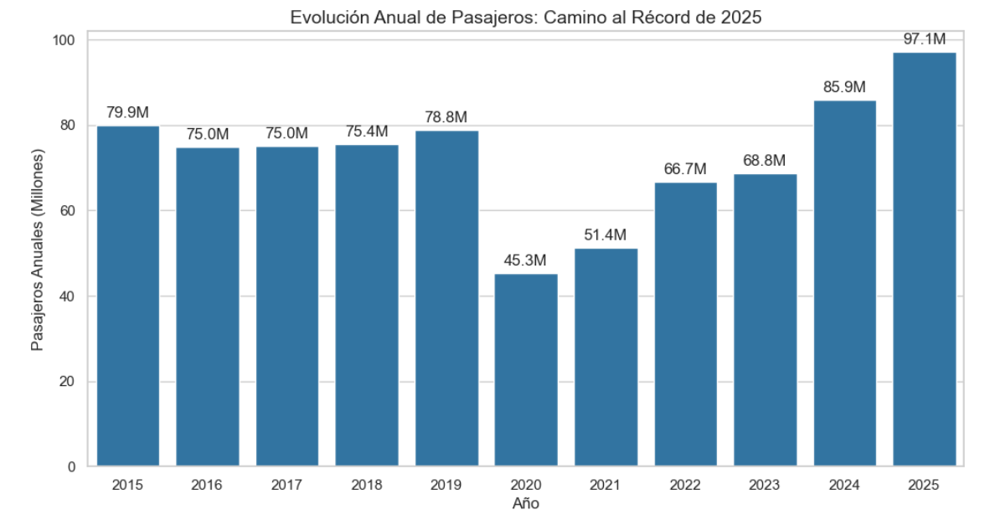
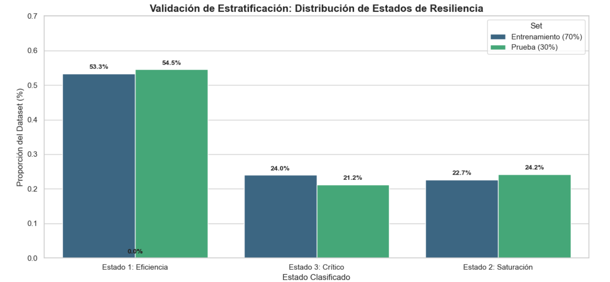
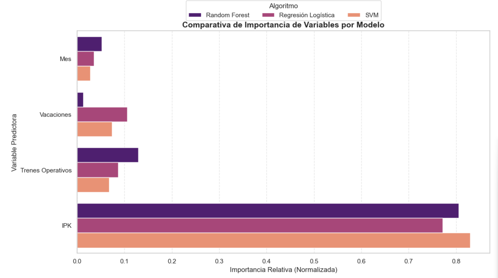
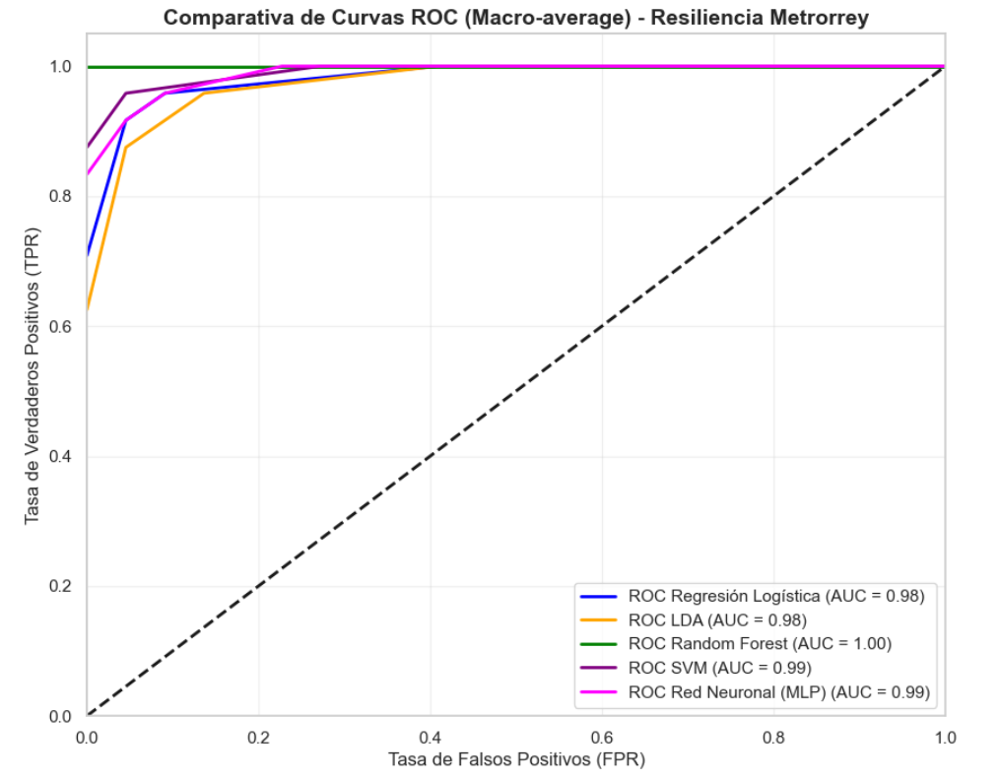

# 🚇 IA y Resiliencia Urbana: STC Metrorrey | Urban Resilience Analysis

<p align="center">
  
  
  
  
  
  
</p>

---

## 🌎 Choose your language / Seleccione su idioma / Escolha seu idioma

<details>
<summary><b>English (EN-US) 🇺🇸</b></summary>

### 📌 Project Overview
Developed at **Universidad de Monterrey (UDEM)**, this research implements an Intelligent Transportation System (ITS) to classify the "Level of Service" (LoS) for the Monterrey Metro. Using historical data from INEGI (2014-2026), we modeled the system's resilience to predict and prevent infrastructure saturation.

### 🔬 Methodology & Evolution
1. **Data Engineering:** Analysis of IPK (Passengers per Kilometer) based on international UIC standards.
2. **Predictive Modeling:** Comparison of 5 architectures (Random Forest, Logistic Regression, MLP, SVM, LDA).
3. **Global Benchmarking:** Alignment with international studies like Seoul Metro (Park et al., 2022).
4. **Strategic Vision:** Impact analysis of the new Lines 4, 5, and 6 on urban mobility.

</details>

<details>
<summary><b>Español (ES-MX) 🇲🇽</b></summary>

### 📌 Descripción del Proyecto
Investigación desarrollada en la **Universidad de Monterrey (UDEM)** que aplica Ciencia de Datos para gestionar la resiliencia operativa del STC Metrorrey. Analizamos el indicador crítico IPK para clasificar el estado del sistema en tiempo real y optimizar la toma de decisiones.

### 📊 Hallazgos Clave
* **Precisión Absoluta:** El modelo Random Forest alcanzó una exactitud del **100%** en la clasificación de estados físicos del sistema.
* **Factor Determinante:** El IPK fue identificado como el pilar de la resiliencia, con una importancia predictiva superior al **80%**.
* **Referente Internacional:** Basado en metodologías aplicadas en el Metro de Seúl para reducir la congestión.

</details>

<details>
<summary><b>Português (PT-BR) 🇧🇷</b></summary>

### 📌 Visão Geral do Projeto
Pesquisa desenvolvida na **Universidad de Monterrey (UDEM)** sobre a resiliência urbana no sistema Metrorrey. Utilizando Machine Learning, o projeto classifica estados de saturação operacional, transformando a gestão reativa em um planejamento preventivo de frota.

### 🔬 Metodologia e Resultados
* **Engenharia Ferroviária:** Integração de padrões **UIC** e dados de frequência do **Moovit** para validar a capacidade da frota.
* **Performance:** Comparação de acurácia entre modelos lineares e Redes Neurais multicamadas.
* **Impacto Social:** Alinhado ao ODS 11 para melhorar a dignidade do transporte masivo e reduzir a densidade de passageiros.

</details>

---

## 🚀 Analysis Journey | Trayectoria | Jornada

| Phase | Model | Key Visual | Insight |
| :--- | :--- | :--- | :--- |
| **1. Demand Evolution** | EDA | `evolucion-anual-pasajeros.png` | Historical tracking of ridership reaching nearly 100M annual trips. |
| **2. Validation** | Stratification | `validacion-estratificacion.png` | Guaranteed statistical consistency between training and testing sets. |
| **3. Importance** | Feature Selection | `importancia-variables.png` | Confirmed IPK as the dominant variable for predicting system saturation. |
| **4. Precision** | ROC Curves | `comparativa-CurvaROC.png` | Multi-model evaluation showing perfect classification capability. |

------

## 📑 Interactive Reports | Reportes | Relatórios (HTML)

*Explore the full technical analysis and interactive visualizations:*

* 🌐 [English: Metrorrey Operational Resilience Analysis](./reports/Clasificacion_Demanda_Operativa_Metrorrey.html)
* 🌐 [Español: Clasificación de Resiliencia STC Metrorrey](./reports/Clasificacion_Demanda_Operativa_Metrorrey.html)
* 🌐 [Português: Inteligência Artificial e Resiliência Urbana](./reports/Clasificacion_Demanda_Operativa_Metrorrey.html)

---

## 🖼️ Visualizations | Visualizaciones | Visualizações

<table align="center">
  <tr>
    <td align="center"><b>1. Annual Ridership Trend</b><br></td>
    <td align="center"><b>2. Stratification Validation</b><br></td>
  </tr>
  <tr>
    <td align="center"><b>3. Variable Importance (IPK)</b><br></td>
    <td align="center"><b>4. Model Precision (ROC)</b><br></td>
  </tr>
</table>

---

## 🛠️ Tech Stack | Stack Tecnológico
- **Python 3.11+** (`Pandas`, `Scikit-learn`, `Matplotlib`, `Seaborn`).
- **Data Source:** INEGI ETUP (2014-2026).

## 📂 Structure | Estructura
* `/data`: Historical Metrorrey datasets from INEGI.
* `/notebooks`: Source code and model training (.ipynb).
* `/reports`: Final technical report (HTML).
* `/visuals`: Model evaluation plots.

## ⚙️ Setup
```bash
git clone [https://github.com/douglasbarbosaoliveira/Analisis-Metrorrey-MetroMonterrey.git](https://github.com/douglasbarbosaoliveira/Analisis-Metrorrey-MetroMonterrey.git)
pip install -r requirements.txt
